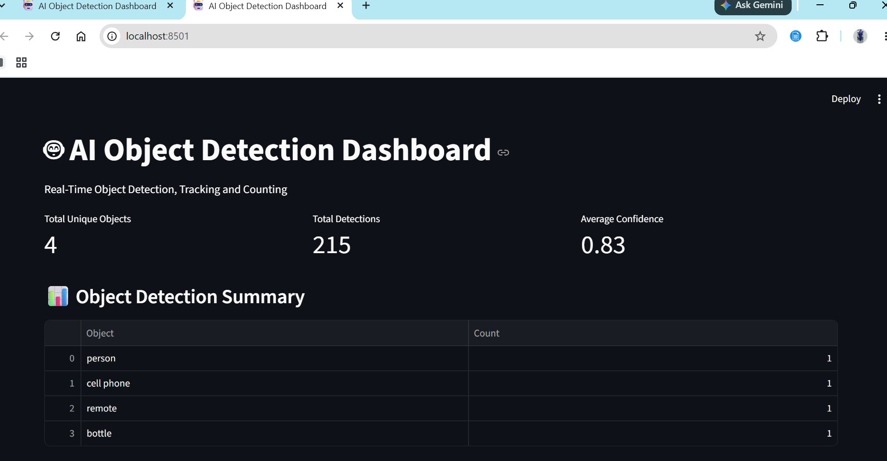
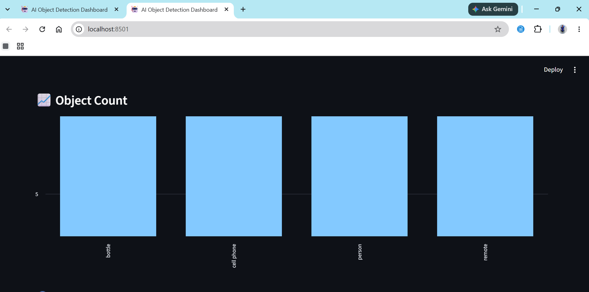
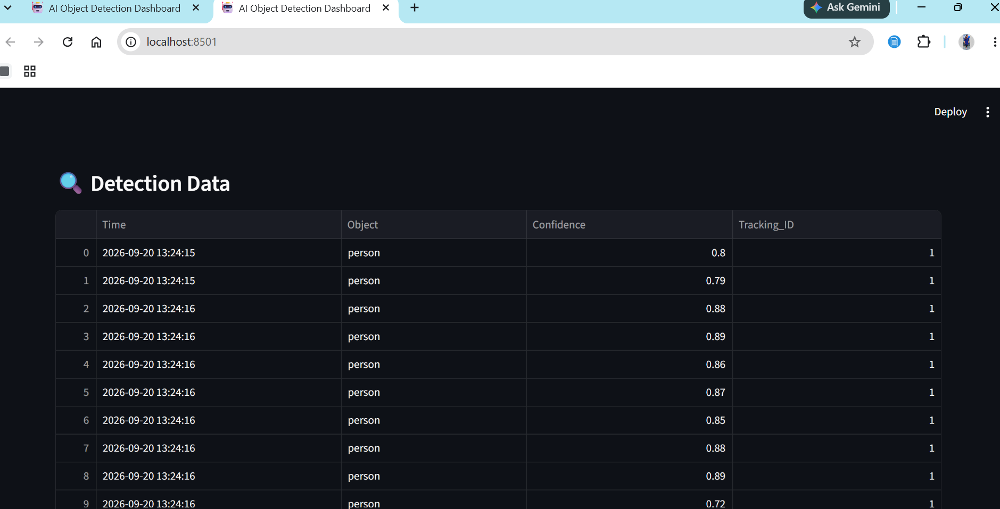
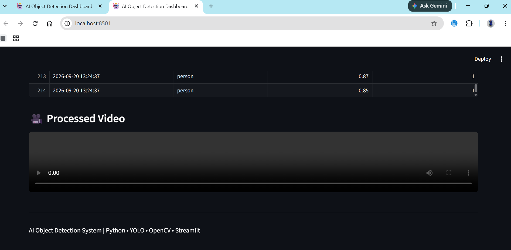

# 🤖 AI Object Detection System

A real-time AI-based object detection, tracking, and counting system developed using Python, YOLO, and OpenCV.

## 📌 Project Overview

This project detects objects from a webcam or video using the YOLO object detection model.

The system can:

* Detect multiple objects
* Track detected objects using unique IDs
* Count detected objects
* Display confidence scores
* Calculate real-time FPS
* Record processed video
* Store detection data in CSV format
* Generate a detection summary report
* Display results through an interactive Streamlit dashboard

## 🚀 Features

### 1. Object Detection

Detects objects such as people, bottles, cell phones, remotes, and other supported YOLO classes.

### 2. Object Tracking

Assigns a unique tracking ID to detected objects and tracks them across video frames.

### 3. Object Counting

Displays the number of detected objects for each object category.

### 4. Confidence Score

Displays the confidence level for each detected object.

### 5. FPS Monitoring

Displays the processing speed in frames per second.

### 6. Video Recording

Saves processed webcam and video results.

### 7. CSV Data Logging

Stores detection information including:

* Time
* Object name
* Confidence
* Tracking ID

### 8. Detection Report

Generates a text-based summary containing the unique objects detected.

### 9. Streamlit Dashboard

Provides a browser-based dashboard for viewing:

* Object counts
* Total detections
* Average confidence
* Detection data
* Processed video

## 🛠️ Technologies Used

* Python
* YOLO
* Ultralytics
* OpenCV
* NumPy
* Pandas
* Streamlit
* CSV

## 📁 Project Structure

```text
AI_Object_Detection
│
├── images
│
├── output
│   ├── tracked_video.mp4
│   └── video_detection_result.mp4
│
├── main.py
├── video_detection.py
├── summary.py
├── dashboard.py
├── detections.csv
├── detection_report.txt
└── README.md
```
## 📸 Dashboard Screenshots

### Dashboard - Overview


### Object Summary


### Detection Data


### Processed Video



## ▶️ How to Run

### Step 1: Activate Virtual Environment

```powershell
.\venv\Scripts\Activate.ps1
```

### Step 2: Run Webcam Detection

```powershell
python main.py
```

### Step 3: Generate Detection Report

```powershell
python summary.py
```

### Step 4: Process Saved Video

```powershell
python video_detection.py
```

### Step 5: Open Dashboard

```powershell
streamlit run dashboard.py
```

The Streamlit dashboard will open in the browser.


## 📊 Output

The system generates:

```text
detections.csv
detection_report.txt
output/tracked_video.mp4
output/video_detection_result.mp4
```

## 🎯 Future Enhancements

* Custom object detection model training
* Real-time alert system
* Object movement analysis
* Web-based camera streaming
* Database integration
* Email/SMS notifications
* Improved detection performance

## 👩‍💻 Author

Kowsalya S

B.E. Computer Science and Engineering
